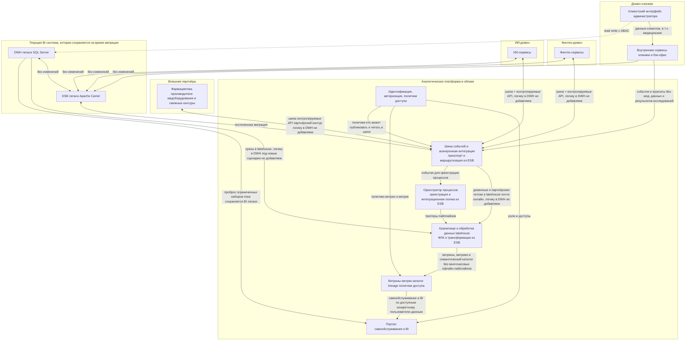

# Цели бизнеса

- выручка и устойчивость финансовых сервисов
- скорость выхода изменений на рынок (time-to-market)
- качество и соответствие регуляторике медицинских и финансовых данных
- масштабирование новых направлений бизнеса

# Проблемы и приоритизация

| Проблема | Почему это больно | Затронутые бизнес-сценарии | MoSCoW |
|----------|-------------------|----------------------------|--------|
| Бизнес-логика и тяжёлые трансформации сконцентрированы в легаси DWH на устаревшем SQL Server | Долгие прогоны отчётов | Быстрое управленческое решение по финансовым и операционным данным. Подключение фармы и производителей электроники без переделки хранилища | Must |
| Интеграция в основном через одну связку DWH ↔ ESB | Узкое горлышко: единые контракты, сложно развивать домены независимо | Независимый выпуск финтех- и ИИ-функций. Интеграция новых сервисов | Must |
| Отсутствует отдельный контур аналитической платформы и каталога витрин | Self-service упирается в кастомные пайплайны | Портал самообслуживания: воспроизводимость отчётности для разных направлений | Should |
| Один DWH включает и клинические сущности (карты болезней исследования) и финансовые операционные и прочие наборы BI с большими кастомизациями описан именно над DWH без отдельного контура только для медданных | Доп. нагрузка на разделение доступов между клинической, операционной и финансовой аналитикой | Требование витрины самообслуживания без медицинских данных и результатов исследований. Фокус на ИБ и регуляторике медицинсикх и финансовых данных. | Must |
| Большой объем данных без облачного горизонтального масштабирования | Замедление time-to-market на новые срезы | Конкурентный запуск новых продуктов, партнёрских программ и контроль затрат | Should |

# Целевая архитектура через год

## Изменения относительно текущей схемы

- Центральная пара DWH ↔ ESB сохранена для совместимости, но добавлен параллельный контур BUS и облачная платформа LAKE→SEM→PORTAL для отчётности и масштабирования.
- ИИ-сервисы и финтех-сервисы получают целевой обмен через BUS контролируемыми каналами; ESB не остаётся единственной шиной.
- Внешние партнёры связаны через шину и контролируемые API: доменные потоки попадают в lakehouse платформы без расширения логики в центральном DWH.
- Внутренние сервисы домена клиники показаны как источник истины. Интерфейс администратора в первую очередь работает с ними. Медицинские данные остаются в регламентированных контурах.
- Портал и BI переносятся на семантический слой и IAM. Временно сохраняется ограниченный проброс из DWH.

## Судьба ESB на время миграции миграции

Kafka (BUS) закрывает только транспорт и маршрутизацию сообщений. Остальные функции ESB распределяются по новым компонентам:

| Функция ESB | Куда переходит | Компонент на схеме |
|-------------|---------------|-------------------|
| Транспорт и маршрутизация сообщений | Kafka-топики с явными контрактами | BUS |
| ФЛК и трансформации данных | dbt-модели и Spark-джобы | LAKE |
| Оркестрация процессов и интеграционные пайплайны | Оркестратор (Temporal / Airflow) | ORCH |
| Адаптеры и протокольные преобразования | API Gateway + доменные сервисы | доменные контуры |
| Бизнес-логика, встроенная в маршруты ESB | Доменные сервисы финтех / клиника / ИИ | FT / INT / AI |

Маршруты ESB не переносятся "за один раз". Каждый маршрут анализируется отдельно и переписывается в нужный компонент.
