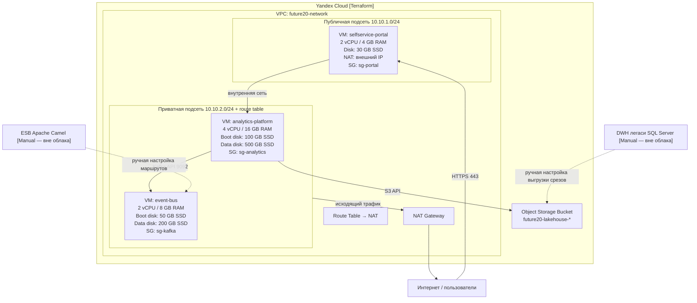

# Диаграмма автоматизации развёртывания

## Что управляется Terraform

| Компонент | Ресурс Terraform |
|-----------|-----------------|
| VPC сеть | `yandex_vpc_network` |
| Публичная подсеть | `yandex_vpc_subnet.public` |
| Приватная подсеть | `yandex_vpc_subnet.private_routed` |
| NAT Gateway | `yandex_vpc_gateway.nat` |
| Таблица маршрутов | `yandex_vpc_route_table.private_rt` |
| Security groups (3 шт.) | `yandex_vpc_security_group` |
| VM analytics-platform | `yandex_compute_instance.analytics` |
| VM event-bus | `yandex_compute_instance.kafka` |
| VM selfservice-portal | `yandex_compute_instance.portal` |
| Data disk analytics (500 GB) | `yandex_compute_disk.analytics_data` |
| Data disk kafka (200 GB) | `yandex_compute_disk.kafka_data` |
| Object Storage bucket | `yandex_storage_bucket.lakehouse` |

## Что разворачивается вручную

| Компонент | Причина |
|-----------|---------|
| DWH SQL Server | Легаси on-premise, миграция поэтапная |
| ESB Apache Camel | Легаси on-premise, маршруты переводятся постепенно |
| Установка ПО на VM (Kafka, Spark, Superset) | Выполняется через Ansible / cloud-init после `terraform apply` |
| DNS-записи и TLS-сертификаты | Зависят от регистратора и CA, настраиваются отдельно |
| IAM-сервис (Keycloak) | Разворачивается отдельным пайплайном после базовой инфраструктуры |

## Обоснование конфигурации

VM analytics-platform (4 vCPU / 16 GB / boot 100 GB + data 500 GB) — узел lakehouse и Spark. Аналитические задачи требуют памяти для in-memory обработки; 16 GB — минимальный рабочий размер для Spark с умеренной нагрузкой. Data disk 500 GB выделен отдельно от boot, чтобы данные не терялись при пересоздании VM и диск можно было расширить независимо.

VM event-bus (2 vCPU / 8 GB / boot 50 GB + data 200 GB) — брокер Kafka. Kafka чувствителен к дисковому I/O, поэтому data disk на network-ssd вынесен отдельно. 200 GB покрывает retention для нескольких доменов при умеренном трафике; при росте нагрузки диск заменяется без пересоздания VM.

VM selfservice-portal (2 vCPU / 4 GB / boot 30 GB) — Superset / Metabase. Портал stateless: данные хранятся в lakehouse и семантическом слое, поэтому отдельный data disk не нужен. NAT включён на этой VM, потому что она единственная точка входа из интернета; остальные VM в приватной подсети и выходят наружу только через NAT Gateway.

NAT Gateway + route table на приватной подсети — стандартный паттерн: внутренние VM не имеют публичных IP, но могут скачивать пакеты и обращаться к внешним API. Это снижает поверхность атаки.

Object Storage bucket — lakehouse raw layer. Managed object storage дешевле и надёжнее, чем хранить сырые данные на дисках VM. Bucket создаётся с закрытым доступом; политики доступа настраиваются через IAM отдельно.

Terraform описывает желаемое состояние инфраструктуры, а не последовательность команд. Повторный запуск `terraform apply` не создаёт дубликаты — он приводит реальное состояние к описанному в конфигурации. Изменение параметра фиксируется в коде, проходит ревью и применяется предсказуемо.

Конфигурация хранится в Git вместе с остальным кодом проекта. Любой инженер может поднять идентичную среду командой `terraform apply` с нужными значениями переменных. Разделение на `variables.tf` и `terraform.tfvars` позволяет переиспользовать одну конфигурацию для разных окружений без правки основного кода. Object Storage и диски масштабируются независимо от VM.
